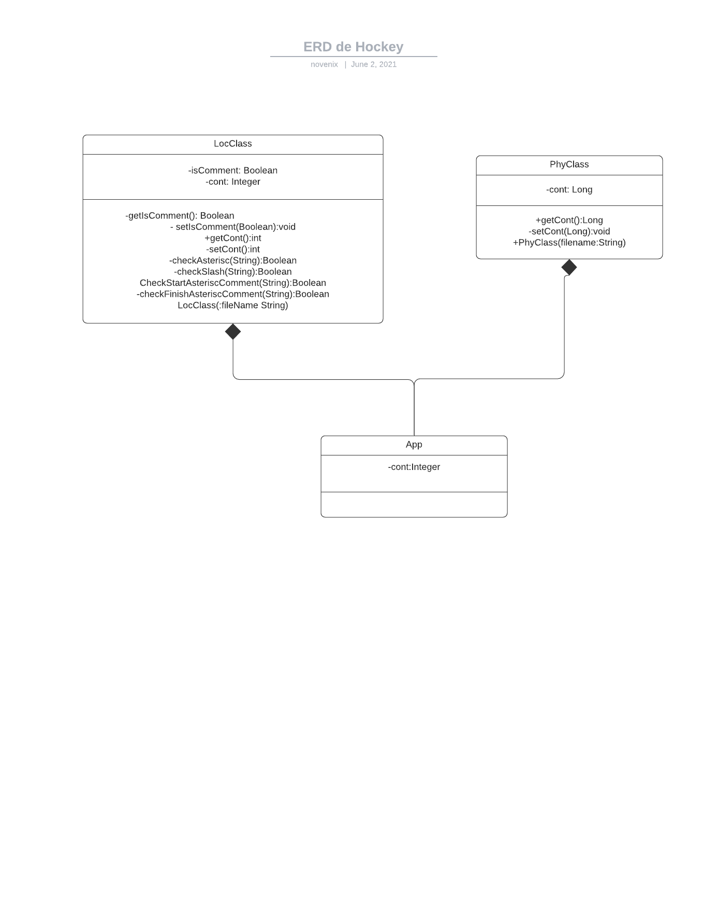

# LOC Counting
Loc / 10 = 179 / 10 = 17;
## INTRODUCTION
    Use Maven, Git, JUnit, and GITHUB.
Write a program to Count the Lines of Code of a source file. The Lines Of Code (LOC) of a
program are often used as software metric to compare complexity and to measure productivity.
For example, suppose you spend 6 hours to complete this assignment, including design, tests,
documentation, repository management and delivery. No suppose that your code has 60 LOC.
Then your productivity for this project is 10 LOC/h. Note that this metric considers the full
development cycle.
Register the time expend in this project and compute the LOC/h.
Your program should be a command line program that receives a three letters parameter and
the name of a file with the source code. It then outputs the number of lines of the source
program.
For example, a typical invocation will be:
> countlines phy countline.java

If the parameter of the invocation is “phy” the program prints the physical lines of the source
code.
If the parameter is “loc” the program will print the Lines of Code found. This is the physical
lines without the comments and white lines.
Modify your program to take into account wildcards and recursive selection of files within a
directory.
Follow the coding principles found in (https://google.github.io/styleguide/javaguide.html).
Thoroughly test the program. Test the program with two source files and write a report of tests
including the original files. Use Junit Tests.
## Tests
This project includes tests that are located in
```
edu.escuelaing.arsw.AppTest
```
## Installation

in root folder please run:
```
MVN Package
```
## Run Project
You can run the project running the following commands:
```
loc C:\Users\Acer\Desktop\escuela\inter\loc-count\Loc-counting\src\main\java\edu\escuelaing\arsw\*.java
```
- wich will run the program and return the number of no commentend lines and new lines .java files
```
phy C:\Users\Acer\Desktop\escuela\inter\loc-count\Loc-counting\src\main\java\edu\escuelaing\arsw\*.java
```
- wich will run the program and return every number of lines in all .java files


## Class Diagram


[]()

In the class diaram you can seea main class that is App.java, that uses PhyClass and LocClass.

**PhyClass**
- Cont: is the number of total lines in the file (Private)
- getCont(): allows get the number of total lines in the file (public)
- setCont(); allows set the number of lines in the file, this calculates only one time (private)
- phyClass(filename:String):is the constructor of the class, recieves the filename to read

**LocClass**
- Cont: is the number of total lines in the file (Private)
- isComment: boolean that allows know if a line is a comment(is activated when some comement starts with /* and desactivate when a comment finish with */) (private)
- getIsComment():returns boolean value of isComment
- setIsComment():recieves the boolean value to set isComment value
- getCont(): allows get the number of total lines in the file after check the rules (public)
- setCont(); allows set the number of lines in the file,returns the new value and only adds +1 to the current cont value (private)
- checkAsterisc(String):recieves the line to check if starts with asterisc and first make trim to eliminate outside spaces and check if starts with "*"
- checkSlash(string):recieves the line to check if starts with double slash "//" first make trim to eliminate outside spaces and check
- checkStartAsteriscComment(string)::recieves the line to check if starts with "/*" first make trim to eliminate outside spaces and check
- checkFinishAsteriscComment(string):recieves the line to check if finish with "*/" first make trim to eliminate outside spaces and check
- LocClass(filename:String):is the constructor of the class, recieves the filename to read


**App**
- is the main app class

02/June/2021


## License

MIT

**Nicolás Torres Páez**
**colombia school of engineering Julio Garavito**

